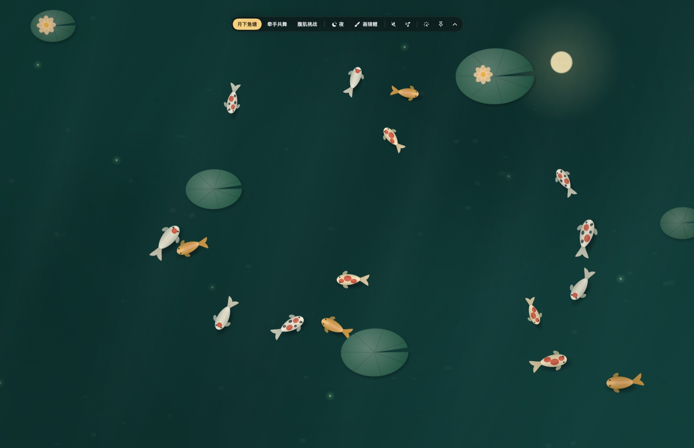
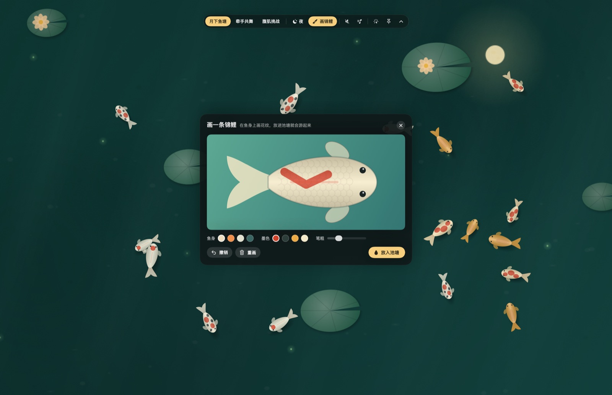
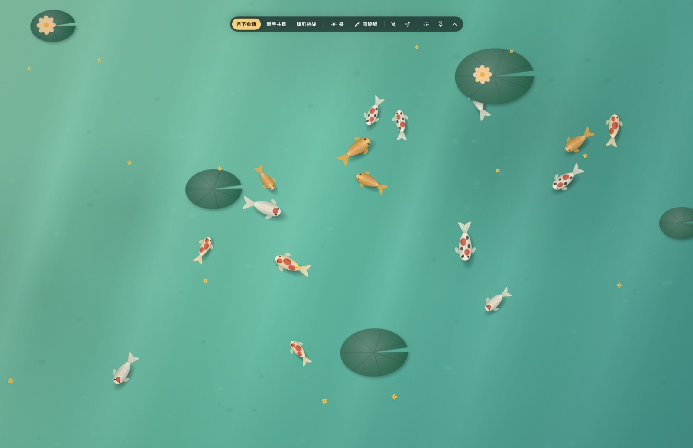
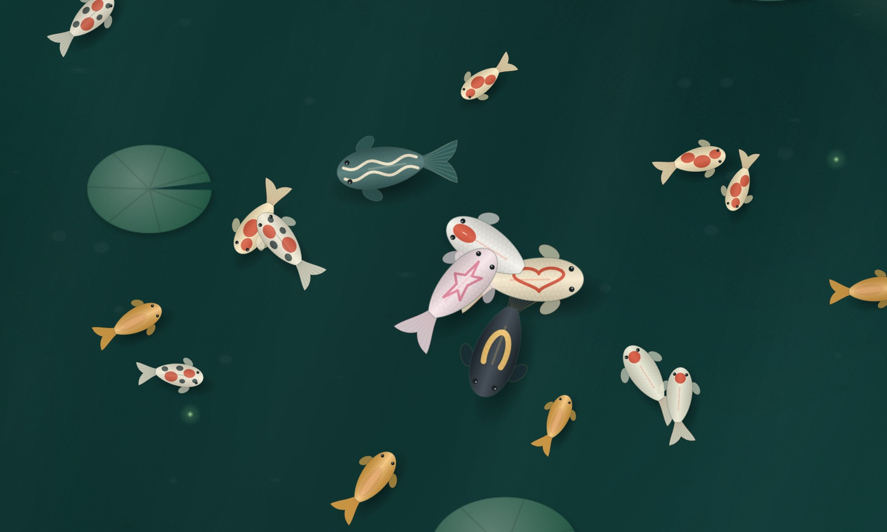

<div align="center">

# 🏮 中秋赏鱼 KoiPond

**把 Mac 桌面变成一池月下锦鲤 —— 点水撒食，鱼会游过来；画一条自己的鱼，放进去它就游**

[](https://github.com/CatCatUncle/koipond/stargazers)
[](LICENSE)
[](Package.swift)
[](Package.swift)
[](build-app.sh)

原生 SwiftUI + SpriteKit，常驻 60fps，空闲 CPU 个位数；零第三方依赖、零联网。

[下载即用](#-下载即用) · [怎么玩](#-怎么玩) · [**让 AI 帮你玩**](#-让-ai-帮你玩codex--openworkbuddy--claude-code) · [自己编译](#️-自己编译) · [性能是怎么做的](#-性能是怎么做的) · [**企业 FDE 合作**](#-关于作者--合作)

<b>🤝 推荐搭配 <a href="https://github.com/CatCatUncle/openworkbuddy">OpenWorkBuddy</a> 使用 —— 最好用的本地开源 AI 办公 Agent</b><br>
<sub>🏢 企业 FDE 驻场 / Agent 落地 / 私有化部署合作 → <a href="mailto:contact@aijentra.com"><b>contact@aijentra.com</b></a></sub>

</div>

> [!IMPORTANT]
> ### 🤝 推荐搭配 [OpenWorkBuddy](https://github.com/CatCatUncle/openworkbuddy) 一起用
>
> **[OpenWorkBuddy](https://github.com/CatCatUncle/openworkbuddy) —— 最好用的本地开源 AI 办公 Agent。** 跑在你自己电脑上，说一句话，它自己规划、动手、验收，
> 把 PPT / Word / Excel / 网页直接落到硬盘上；DeepSeek、通义千问、豆包、Claude、Ollama 都能接。
>
> - 🏢 **适合企业本地部署**：数据不出本机 / 内网，支持 Docker 一键部署
> - 🛠️ **支持商用二次开发**：个人免费，企业商用与二次开发提供商业授权
> - 🐟 **桌面上养鱼，干活交给它**：鱼塘负责赏心悦目，报表和 PPT 让 OpenWorkBuddy 去做
>
> 👉 **[github.com/CatCatUncle/openworkbuddy](https://github.com/CatCatUncle/openworkbuddy)** [](https://github.com/CatCatUncle/openworkbuddy/stargazers)

> A native macOS desktop toy: a moonlit koi pond that lives behind your windows. Click the
> water to feed the fish, paint your own koi and release it into the pond. SwiftUI + SpriteKit,
> 60fps, zero dependencies, no network access.

> [!TIP]
> **⭐ 求一个 Star！** 如果这池鱼让你的桌面顺眼了一点，请给
> **[KoiPond](https://github.com/CatCatUncle/koipond)** 和 **[OpenWorkBuddy](https://github.com/CatCatUncle/openworkbuddy)** 都点一下 Star。

<p align="center">
  
  <br><sub>月下鱼塘。顶部控制栏会自动收起，鼠标移到屏幕顶部中间就出来</sub>
</p>

<table>
<tr>
<td width="50%"><br><sub>画一条锦鲤：选鱼身颜色和墨色，在鱼身上随手画，放进池塘就游起来</sub></td>
<td width="50%"><br><sub>白天模式</sub></td>
</tr>
</table>

## ✨ 能做什么

| | |
|---|---|
| 🌕 **月下鱼塘** | 十几条锦鲤成群游动，荷叶浮在鱼上面，月光和萤火点点；昼夜一键切换 |
| 🍚 **撒鱼食** | 点水面撒一把，附近的鱼会游过来抢；鼠标一动鱼就散开，停一会儿又慢慢凑过来 |
| 🖌️ **画锦鲤** | 在鱼身上画自己的花纹，放进池塘后花纹贴着鱼身一起摆动；最多留 20 条，重启还在 |
| 💃 **牵手共舞 / 腹肌挑战** | 两个角色小场景，点一下有反应 |
| 🎵 **配乐** | 选一首本地音乐循环播放，不带任何内置音频 |
| 🔗 **链接遥控** | `koipond://` 链接切场景、撒食、弹提示、放一条画好的鱼——脚本、快捷指令、AI Agent 都能指挥 |
| 🤖 **自带 AI 技能** | 仓库就是一个 Agent 插件，装进 OpenWorkBuddy / Codex / Claude Code，说一句「画条肚子上有爱心的锦鲤」就放进来了 |
| 🖱️ **两种模式** | 互动模式能逗鱼；穿透模式鱼塘沉到桌面图标下面，点击全部穿过去，桌面照常用 |

## 📦 下载即用

到 [Releases](https://github.com/CatCatUncle/koipond/releases) 下载 `KoiPond-macOS.zip`，解压后把 `KoiPond.app` 拖进「应用程序」。

应用没有经过 Apple 公证，第一次打开会被拦。任选一种放行：

- 在 Finder 里**右键 → 打开**，再点一次「打开」
- 或者在终端执行：`xattr -dr com.apple.quarantine /Applications/KoiPond.app`

打开后它不占 Dock，只在菜单栏留一个图标，所有设置都在那个菜单里。

## 🎮 怎么玩

| 操作 | 效果 |
|---|---|
| 鼠标移到屏幕顶部中间 | 控制栏出来；移开几秒后自动收起。点 📌 让它常驻 |
| 点水面 | 撒鱼食 |
| 点荷叶 | 荷叶晃一下，荡开水波 |
| 控制栏「画锦鲤」 | 打开画鱼窗口，画完点「放入池塘」 |
| 菜单栏 → 穿透模式 | 鱼塘不再接收点击，桌面图标、拖文件都正常 |
| 菜单栏 → 互动模式 | 切回来逗鱼 |
| 菜单栏 → ⌘1 / ⌘2 / ⌘3 | 切场景 |
| 菜单栏 → 退出鱼塘 | ⌘Q |

## 🔗 用链接遥控鱼塘

装好并打开过一次之后，任何能打开网址的东西都能指挥鱼塘。`-g` 表示在后台执行、不抢焦点：

```bash
open -g "koipond://scene/pond"                                  # 切场景：pond / dance / touch
open -g "koipond://night?on=1"                                  # 入夜；on=0 白天；不带参数就切换
open -g "koipond://feed?x=0.5&y=0.4"                            # 在屏幕这个位置撒一把鱼食（0–1，y 从上往下）
open -g "koipond://caption?title=%E6%B5%8B%E8%AF%95%E9%80%9A%E8%BF%87&seconds=6"   # 弹一条提示（中文要 URL 编码）
open -g "koipond://fish?body=%231F2A33&mark=%23F0C060&pattern=showa&scale=1.3"      # 放一条锦鲤
open -g "koipond://fish/release"                                # 放走所有画的鱼
open -g "koipond://snapshot?path=/tmp/pond.png"                 # 截一张图
open -g "koipond://mode?interactive=0"                          # 穿透模式；1 切回互动
```

不想手写编码，用仓库里的小脚本（只依赖系统自带 Python）：

```bash
S=skills/koipond-fish-designer/scripts/koi-link.py
python3 $S caption "该起来走走了" "已经坐了 50 分钟"
python3 $S fish --body "#F5E8C7" --mark "#D4452A" --preset heart     # 白底红心锦鲤
python3 $S fish --body "#1F2A33" --mark "#F0C060" --preset moon      # 墨鲤驮着金月牙
```

`fish` 还能收一整套自定义笔画（JSON），坐标、预设图案（heart / moon / star / wave / stripes / dots / crown）和配色见 [koipond-fish-designer](skills/koipond-fish-designer/SKILL.md)。写错了鱼塘会弹一条提示告诉你哪里不对，不会静默失败。

### 几个现成玩法

```bash
# 测试跑完：过了弹提示，挂了池塘入夜
npm test && open -g "koipond://caption?title=%E6%B5%8B%E8%AF%95%E9%80%9A%E8%BF%87" || open -g "koipond://night?on=1"

# 番茄钟：25 分钟后鱼群聚到屏幕中间
sleep 1500 && python3 $S caption "休息 5 分钟" && python3 $S feed 0.5 0.5

# 每天 15:00 提醒喝水（crontab -e 加一行）
0 15 * * * open -g "koipond://caption?title=%E5%96%9D%E5%8F%A3%E6%B0%B4"
```

macOS「快捷指令」里用「打开 URL」动作填这些链接，就能绑到快捷键、专注模式或者自动化上。

## 🤖 让 AI 帮你玩（Codex / OpenWorkBuddy / Claude Code）

仓库根目录有 `plugin.json`、`skills/` 三个技能和给编码 Agent 看的 `AGENTS.md`，装进去 AI 就知道怎么遥控鱼塘、怎么画鱼、怎么改源码：

| 技能 | 说一句话试试 |
|---|---|
| [koipond-control](skills/koipond-control/SKILL.md) | 「测试跑完让鱼塘提醒我」「每天下午三点让鱼塘提醒我喝水」「把鱼塘切到晚上」 |
| [koipond-fish-designer](skills/koipond-fish-designer/SKILL.md) | 「画一条肚子上有爱心的锦鲤放进鱼塘」「做一条公司 logo 配色的鱼」「放一条驮着月亮的黑鲤」 |
| [koipond-mod](skills/koipond-mod/SKILL.md) | 「给鱼塘加一个国庆主题」「点荷叶的时候冒出一只青蛙」「加一个 koipond://rain 下雨指令」 |

**OpenWorkBuddy**：专家 · 技能 · 连接器 → 插件 → 粘贴 `https://github.com/CatCatUncle/koipond` 安装，三个技能自动出现，直接在对话里说。

**Codex**：

```bash
git clone https://github.com/CatCatUncle/koipond.git
cp -R koipond/skills/* ~/.codex/skills/     # 全局可用
# 要改源码就直接在仓库里开 codex，它会读 AGENTS.md
```

**Claude Code**：`cp -R koipond/skills/* ~/.claude/skills/`，或者在仓库目录里直接用。

<p align="center"><br><sub>一句话放进来的五条鱼：爱心、墨鲤月牙、星星、青鲤波浪、丹顶</sub></p>

AI 画完鱼会自己截一张鱼塘图看效果，看不清会自己调粗细和大小再放一次。

## 🛠️ 自己编译

需要 macOS 14+ 和 Xcode 16（或同版本的 Command Line Tools，Swift 6）。

```bash
git clone https://github.com/CatCatUncle/koipond.git && cd koipond
./build-app.sh            # 出一个 Apple Silicon + Intel 通用、ad-hoc 签名的 dist/KoiPond.app
open dist/KoiPond.app
```

本机编译出来的不带隔离标记，直接能开。开发时也可以直接跑：

```bash
swift run -c release
```

## 🚀 性能是怎么做的

桌面挂件最怕两件事：卡住桌面，和偷偷吃 CPU。这里做了这些：

- **窗口层级**：互动模式放在桌面图标上一层、所有应用窗口下面；穿透模式沉到桌面层并忽略鼠标，永远不挡正常窗口
- **画锦鲤是独立浮动窗口**：不跟全屏鱼塘抢焦点，第一下点击就能落笔
- **角色图后台解码**：绿幕抠图和切帧在后台线程一次做完，每张图各自一把锁，切场景不等别的图
- **鱼的纹理缓存**：同款花色只画一次，画的花纹按弧长均匀取点，不随笔速变密
- **定时器跑在 common mode**：拖菜单、拖窗口时动画也不停
- **主线程卡顿看门狗**：主线程超过 250ms 没响应会记到 `~/Library/Logs/KoiPond/stalls.log`，方便排查
- **单实例**：新打开的会替换旧的，不会叠出两个鱼塘

## 🧪 调试开关

都是环境变量，给开发和自动化测试用，带这些变量启动时不写用户设置、不替换正在跑的实例：

| 变量 | 作用 |
|---|---|
| `KOI_SELFTEST=1` | 跑 13 项自检（链接解析、窗口层级、点击分发、控制栏、画鱼窗口），打印 PASS/FAIL 后退出 |
| `KOI_TOUR=1` | 依次切过每个场景和开关，打印每一步的帧率和最慢一帧 |
| `KOI_SNAPSHOT=out.png` | 启动后截一张鱼塘图就退出（配 `KOI_SNAPSHOT_DELAY` 秒数） |
| `KOI_SCENE=pond\|dance\|touch` | 指定开场场景 |
| `KOI_NIGHT=0\|1`、`KOI_EDITOR=1`、`KOI_TOOLBAR=0\|1` | 昼夜、打开画鱼窗口、控制栏显隐 |
| `KOI_LINKS="koipond://… koipond://…"` | 启动后依次执行这些链接，配 `KOI_SNAPSHOT` 验效果 |
| `KOI_STATS=1`、`KOI_FPS=30` | 显示 SpriteKit 统计、限制帧率 |

```bash
swift build -c release && KOI_SELFTEST=1 .build/release/KoiPond
```

## 🗂️ 代码结构

```
Sources/KoiPond/
├── KoiPondApp.swift      # 应用入口、窗口、菜单栏、链接执行、自检和巡检
├── Commands.swift        # koipond:// 链接解析
├── PondStage.swift       # 鱼塘：群游、撒食、水波、荷叶
├── FishArt.swift         # 锦鲤绘制和纹理缓存
├── PortraitStages.swift  # 角色小场景
├── Sprites.swift         # 角色图加载、绿幕抠图、切帧
├── Overlay.swift         # 控制栏、提示、画锦鲤编辑器
├── PondState.swift       # 状态与持久化
├── StageScene.swift      # 场景基类
├── Models.swift          # 场景、颜色、锦鲤数据
└── Diagnostics.swift     # 帧率统计、卡顿看门狗
skills/                   # 三个 Agent 技能 + koi-link.py
plugin.json               # Agent Plugin 清单（OpenWorkBuddy 等可直接安装）
AGENTS.md                 # 给编码 Agent 的构建和约定说明
```

## ⭐ Star History

如果这个项目对你有用，**请给 [KoiPond](https://github.com/CatCatUncle/koipond) 和 [OpenWorkBuddy](https://github.com/CatCatUncle/openworkbuddy) 一起点个 Star**，这是对开源作者最好的支持。

[](https://star-history.com/#CatCatUncle/koipond&CatCatUncle/openworkbuddy&Date)

## 👋 关于作者 · 合作

开发者猫叔，前大厂 Agent 工程师，有丰富的 Agent 落地实践经验。

- ✔️ 服务过跨境电商、制造业、AI 初创、私募金融机构、消费品巨头、国央企等客户的 AI 解决方案
- ✔️ 企业 AI 内训 ｜ 企业私有化部署 ｜ 行业智能体 ｜ AI 数字化全案 ｜ AI 搜索优化 ｜ Agent 项目落地

常驻深圳，欢迎前来交流和考察。

> [!IMPORTANT]
> ## 🚀 找开发者猫叔做企业 FDE（驻场工程）与 AI 落地
>
> - **FDE 驻场工程**：工程师进驻企业，把 Agent 从 Demo 做到真正上线、真正有人用
> - **企业私有化部署**：OpenWorkBuddy 等 Agent 在企业内网落地，数据不出域
> - **行业智能体 / Agent 项目定制开发**、**企业 AI 内训**、**AI 数字化全案**、**AI 搜索优化（GEO）**
>
> ### 📮 直接发邮件：**[contact@aijentra.com](mailto:contact@aijentra.com)**

## 📄 License

[MIT](LICENSE)。角色图为 AI 生成素材，随代码一起以 MIT 发布。
